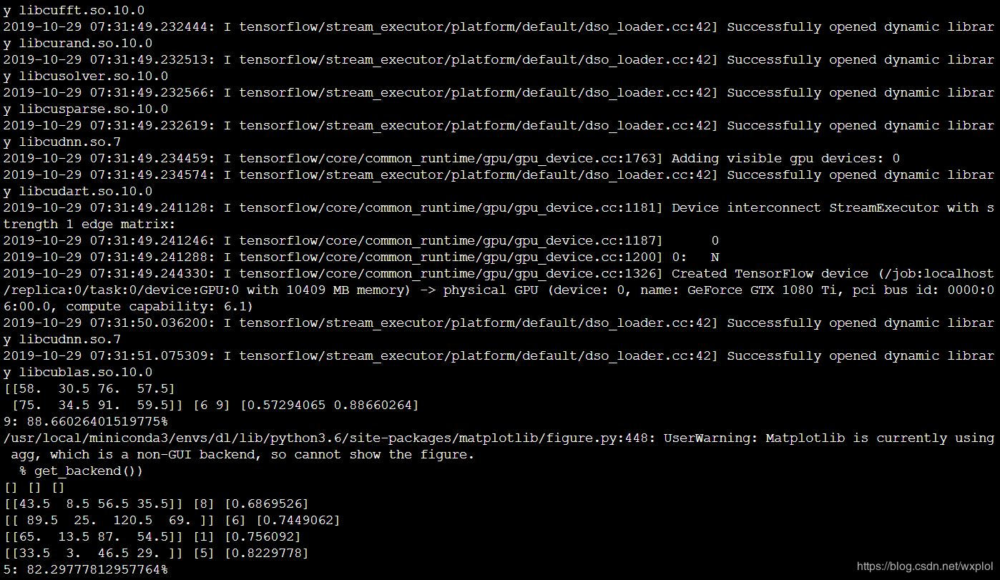
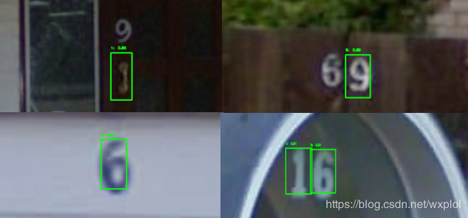

# yolov3

CSDN地址：[【深度学习系列（四）】：基于tensorflow的YOLOV3实现 （1）：YOLOV3初探](https://blog.csdn.net/wxplol/article/details/102797939)

### 1、环境要求
**tensorflow 1.14.0**

**python 3.6**

### 2、数据下载
**代码下载:** <https://github.com/kingqiuol/yolov3.git>

**预训练模型下载:** <https://pan.baidu.com/s/1mFcLkYdQfEJ88md05vAbHg>，提取码：venl

**模型下载:** <https://pan.baidu.com/s/1k19b-HjDHo0AVqv6tzVdpA>，提取码：fqg2

下载完成后，将yolov3.weights放在下载好的github文件夹下，将weights.h5放在model文件夹下。

### 3、模型运行

进入到githib下载的文件夹下，执行检测：

>python interface.py

最终检测结果如下：

由于我们的训练样本总共32张图片，这里只是演示性，没有特别考虑检测的精度，请忽略。。。

### 4、模型训练

当然，如果想自己训练得到weights.h5，进入到githib下载的文件夹下，执行训练：

>python train.py

训练最终结果如下：

